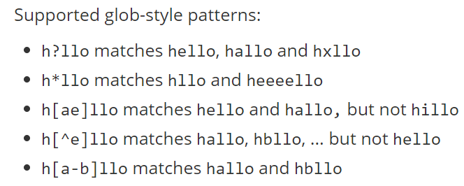

### Keys Command Cheat Sheet

```bash
Set Key value

Get Key

DEL key1 key2 key3 (To delete a key).

EXISTS key1 key2 (To check a key exist or not).

TTL key  (To check time to live).

EXPIRE key 10(in seconds).

PTTL mykey (to check time in millisecond).

PEXPIRE mykey 1500 (Time in Milliseconds).

PERSIST mykey (Remove EXPIRATION from the key)

KEYS a?? (Returns all keys matching pattern)
```

```bash
RANDOMKEY (Return a random key from the currently selected database)

RENAME mykey myotherkey

RENAMENX mykey myotherkey (Renames key to newkey if newkey does not yet exist)

TOUCH key1 key2 (Alters the last access time of a key(s).

UNLINK key1 key2 key3 (The actual removal will happen later asynchronously.)

TYPE key1 (Return Type of Value)

DUMP mykey (Serialize the value stored at key in a Redis-specific format)

RESTORE mykey 0 "\n\x17\x17\x00\x00\x00\x12\x00\x00\x00\x03\x00\”
```


### String Command Cheat Sheet

```bash
APPEND mykey "Hello" (appends the value at the end of the string).

INCR mykey (Increments the number stored at key by one).

INCRBY mykey 5

DECR mykey (Decrements the number stored at key by one.)

DECRBY mykey 3 (Decrements the number stored at key )

INCRBYFLOAT mykey 0.1(Increment the string representing a floating point number)

GETSET mycounter "0" (Atomically sets key to value and returns the old value stored at key)

MSET key1 "Hello" key2 "World" (Sets the given keys to their respective values.)

MGET key1 key2 (Returns the values of all specified keys).

SETNX mykey "Hello" (Set key to hold string value if key does not exist.)

MSETNX key1 "Hello" key2 "there" (Sets the given keys to their respective values.)

GETRANGE mykey 0 3 (Returns the substring of the string value stored at key).

GETRANGE mykey -3 -1. (-1 means the last character and so on).

SETEX mykey 10 "Hello" (Set key to hold the string value and set key to timeout after a given number of seconds.)

PSETEX mykey 1000 "Hello" ( expire time is specified in milliseconds instead of seconds.)

SETRANGE key1 6 "Redis" (Overwrites part of the string stored at key) .

STRLEN mykey ( Returns the length of the string ).
```


### List Command Cheat Sheet

```bash
RPUSH mylist "hello" (Insert all the specified values at the tail of the list stored at key.)

LRANGE mylist 0 -1 (Returns the specified elements of the list stored at key.)

LPUSH mylist "world" (Insert all the specified values at the head of the list stored at key.)

RPUSHX mylist "World" (Inserts value at the tail of the list stored at key, only if key already exists and holds a list.)

LPUSH mylist "World" (Inserts value at the head of the list stored at key, only if key already exists and holds a list.)

RPOP mylist (Removes and returns the last element of the list stored at key.)

LPOP mylist (Removes and returns the first element of the list stored at key.)

LTRIM mylist 1 -1 (Trim an existing list so that it will contain only the specified range of elements specified)

LSET mylist 0 "four" (Sets the list element at index to value.)

LINDEX mylist 0 (Returns the element at index in the list stored at key.)

LINSERT mylist BEFORE "World" "There" (Inserts value in the list stored at key either before or after the reference value pivot.)

LLEN mylist (Returns the length of the list stored at key. )

LREM mylist 2 "hello" (Removes the first count occurrences of elements equal to value from the list stored at key.)
```


### Hashes Command Cheat Sheet

```bash
HSET myhash field1 "Hello".  (Sets field in the hash stored at key to value. If field already exists in the hash, it is overwritten.)

HGET myhash field1 (Returns the value associated with field in the hash stored at key.)


HMSET myhash field1 "Hello" field2 "World" ( Set Multiple values.)

HGETALL myhash  (Returns all fields and values of the hash stored at key.)

HMGET myhash field1 field2 (Returns the values associated with the specified fields in the hash stored at key.)

HEXISTS myhash field1 (Returns if field is an existing field in the hash stored at key.)

HKEYS myhash (Returns all field names in the hash stored at key.)

HLEN myhash (Returns the number of fields contained in the hash stored at key.)

HSETNX myhash field "Hello" (Sets field in the hash stored at key to value, only if field does not yet exist.)

HDEL myhash field1 (Removes the specified fields from the hash stored at key.)

HINCRBY myhash field 1 (Increments the number stored at field in the hash stored at key by increment.)

HINCRBYFLOAT mykey field 0.1 (Increment the specified field of a hash stored at key, and representing a floating point number, by the specified increment.)

HSTRLEN myhash f1 (Returns the string length of the value associated with field in the hash stored at key.)

HVALS myhash (Returns all values in the hash stored at key.)
```

